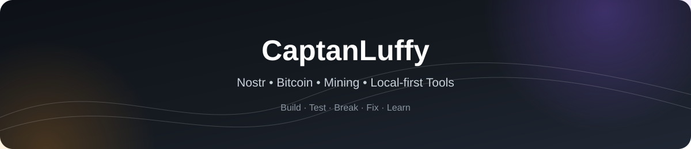

 

### Currently exploring
`Nostr signing` · `Lightning` · `CPU mining` · `Local-first software`

## What I’m working on

<table>
<tr>
<td width="50%" valign="top">

### SkySigner
Nostr signing experiments focused on NIP-07, NIP-46 and client compatibility.

### BlockWave Radio
Mining pool, block, wallet and activity monitoring for desktop use.

### CPU Miner Lab
CPU mining experiments with algorithms, pools and custom mining engines.

</td>
<td width="50%" valign="top">

### NostrStone
A Nostr-based client for sharing and discovering stones and minerals.

### [Localhost Radar](https://github.com/CaptanLuffy/Localhost-Radar)
A Windows utility for discovering and monitoring local services.

### Experimental Tools
Small local-first apps, protocol tests and utilities built around specific ideas.

</td>
</tr>
</table>

## Current focus

`Nostr` · `Bitcoin` · `Lightning` · `Mining` · `Local-first software` · `Windows tools`

## How I build

I like turning unusual ideas into working software, then testing, breaking and improving them until they become useful.

Most of my projects start small, stay practical and are built to learn by doing.

## Connect & Support

<table>
<tr>
<td width="33%" align="center" valign="top">

### Nostr

<code>npub16ntyfte9h8u2pjpc90su57gcw2f9c7yzsjx6uyfpmaq3tfuxk7lq8ty8ka</code>

</td>
<td width="33%" align="center" valign="top">

### Lightning

<code>skylords@blink.sv</code>

</td>
<td width="33%" align="center" valign="top">

### Bitcoin

<code>bc1qnxuyu5c7wkvdj9ez50r0ryack8asw2cdlrd69z</code>

</td>
</tr>
</table>

---

**Build · Test · Break · Fix · Learn**

